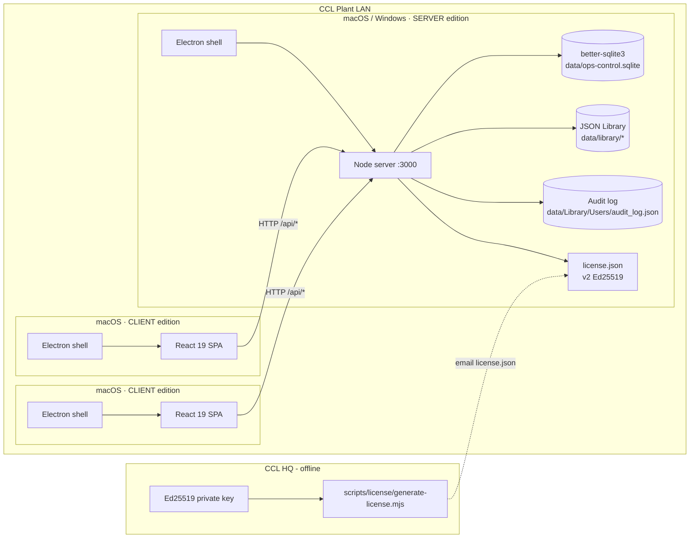
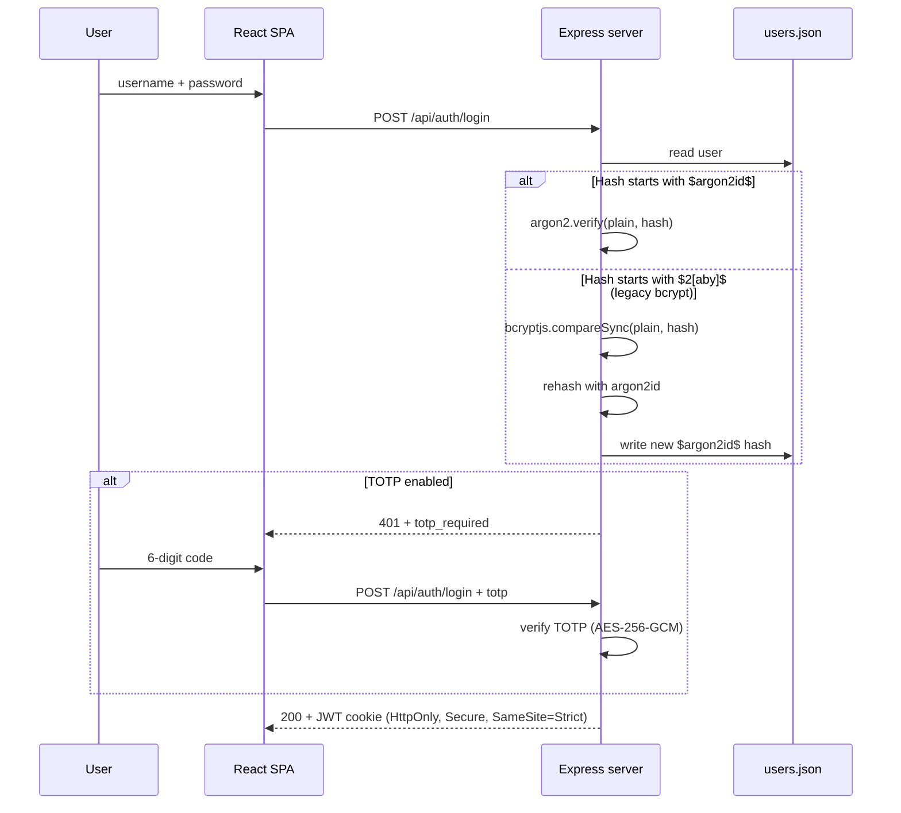
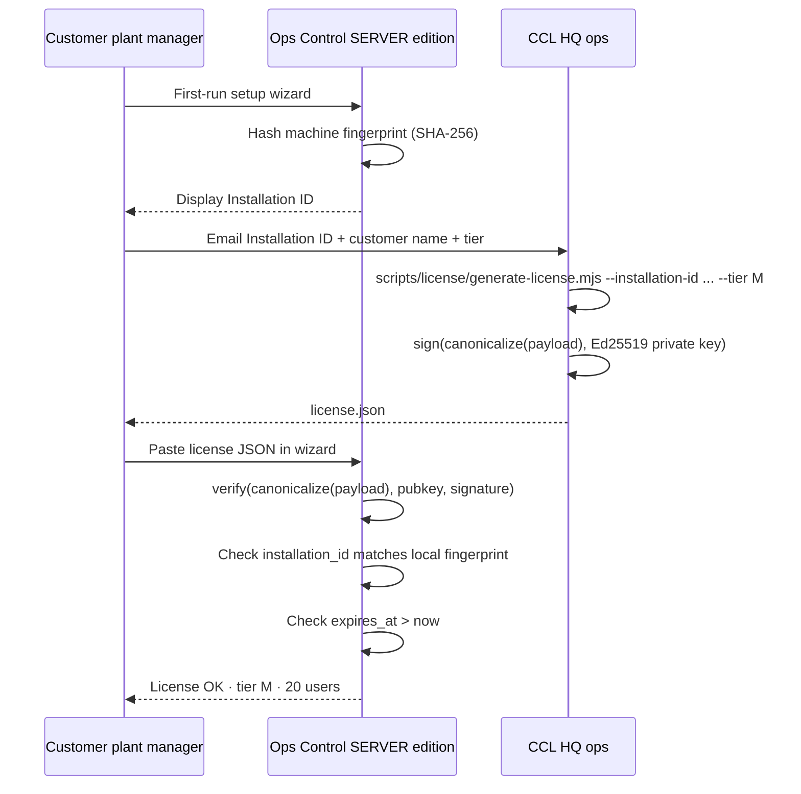
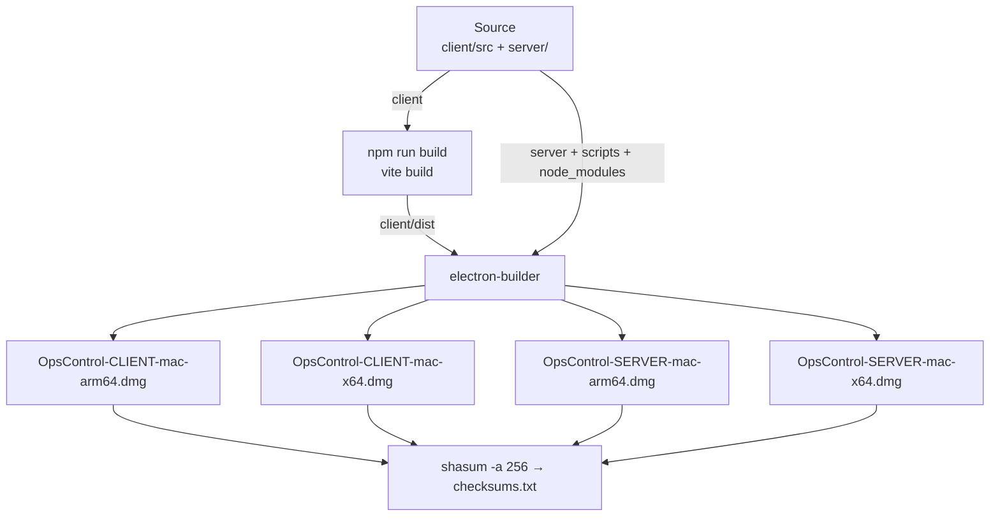

# Architecture — Ops Control v1.3

> Sơ đồ kiến trúc Client–Server v1.3 (sau autonomous upgrade pass).

## 1. High-level



## 2. Layer model (server side)

```
┌─────────────────────────────────────────────────────────────┐
│  apps/                  electron + node entry points         │
│  └── desktop/main.js    Electron, forks node server          │
│  └── server/index.js    Express boot, mounts routers         │
├─────────────────────────────────────────────────────────────┤
│  domains/               bounded contexts (in-progress migration)│
│  ├── security/          users, audit, permission groups      │
│  ├── costing/           Standard/Complex/Print/Ink/Design    │
│  ├── library/           Material/Rate/Finance/DDL/Mfg/Routing│
│  ├── sales/             RFQ/Quote/Analysis/Formal            │
│  ├── planning/          Order/WIP/Capacity/BOM               │
│  ├── quality/           Sample tracking                      │
│  ├── basis/             Settings/Backup/Health/Sync          │
│  └── mes/               IFS/Hardware/Connection mode         │
├─────────────────────────────────────────────────────────────┤
│  platform/              cross-cutting (no business logic)    │
│  ├── auth/              argon2id, JWT, TOTP                  │
│  ├── audit/             append-only audit store              │
│  ├── http/              middleware (auth, rateLimit, validate)│
│  ├── storage/           atomic write, lockfile, sqlite       │
│  └── i18n/              registerStrings() + per-domain modules│
└─────────────────────────────────────────────────────────────┘

  Dependency rule:  apps → domains → platform     (never reverse)
                              ╲────→ platform
```

## 3. Tech stack

| Layer    | Tech                                                           | Version     |
| -------- | -------------------------------------------------------------- | ----------- |
| Frontend | React 19 + Vite 8 + react-router-dom 6                         | latest      |
| Backend  | Express 4 + better-sqlite3 12                                  | latest      |
| Auth     | argon2id (`argon2`) + JWT cookie + TOTP AES-256-GCM            | argon2 0.44 |
| License  | Ed25519 (`node:crypto`)                                        | –           |
| Desktop  | Electron 38+ + electron-builder 26                             | latest      |
| Native   | `serialport`, `node-hid`, `pdf-to-printer`, `electron-store 8` | unchanged   |
| Test     | `node:test` (server) + Jest 29 (root) + `node:test` (client)   | –           |
| Lint     | ESLint 9 (flat config) + Prettier 3                            | –           |
| CI       | GitHub Actions 5 jobs                                          | –           |

## 4. Auth flow



## 5. License flow



## 6. License tier enforcement

`POST /api/users` middleware chain:

```
authMiddleware → requireRole('admin') → requireSeatAvailable() → handler
                                              │
                                              ├─ getLicense() → tier, max_users
                                              └─ countActiveUsers() (excludes soft-deleted, sys)
                                              if (active >= max_users)
                                                return 402 LICENSE_LIMIT_EXCEEDED
```

## 7. CSP layers

```mermaid
flowchart LR
  Req[HTTP response] --> WR[onHeadersReceived]
  WR --> CSP[Inject CSP header]
  CSP --> default["default-src 'self'"]
  CSP --> script["script-src 'self' 'unsafe-inline' 'unsafe-eval'"]
  CSP --> style["style-src 'self' 'unsafe-inline'"]
  CSP --> img["img-src 'self' data: blob:"]
  CSP --> conn["connect-src 'self' http://127.0.0.1:* http://localhost:*"]
  CSP --> frame["frame-src 'none'"]
  CSP --> obj["object-src 'none'"]
```

## 8. Build pipeline



## 9. ADR (architecture decisions)

| #    | Decision                                                   | Why                                                         |
| ---- | ---------------------------------------------------------- | ----------------------------------------------------------- |
| 0001 | Keep on-prem stack (Express + better-sqlite3 + JSON store) | LAN deploy, no SaaS payback                                 |
| 0002 | argon2id over bcrypt                                       | OWASP top recommendation, GPU-resistant                     |
| 0003 | Ed25519 license signing                                    | Asymmetric → leaked client install can't sign fake licenses |
| 0004 | License tier S/M/L = 15/20/50                              | Per IMPROVEMENT_BRIEF.md ¶4.5                               |
| 0005 | electron-builder over Tauri                                | Native module compatibility, 0 migration cost               |
| 0006 | In-place v1.2 hardening (not v1.3 layout port)             | No git repo; rewrite would multi-week                       |
