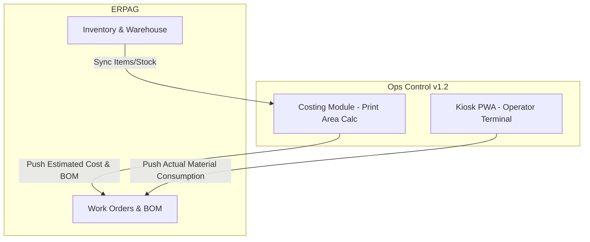

# [Ops Control v1.2] Assessment & ERPAG Migration Report

## Executive Summary

Báo cáo đánh giá mức độ tương thích giữa hệ thống Ops Control v1.2 hiện tại và phần mềm quản trị ERPAG. Báo cáo bao gồm kết quả khảo sát 5 phân hệ cốt lõi trên ERPAG, bảng mapping module, lộ trình chuyển đổi và phân tích chuyên sâu lỗi sai lệch định mức Scrap ở module BOM Explosion. Mục tiêu là tận dụng tối đa hệ sinh thái chuẩn của ERPAG trong khi vẫn giữ lại các module đặc thù ngành in (Costing/Kiosk) của Ops Control.

## ERPAG Survey

Kết quả khảo sát 5 phân hệ cốt lõi trên ERPAG (Môi trường Trial2):

1. **Work Orders (Manufacturing)**: Giao diện quản lý quy trình sản xuất (Routing) và Work Order Lifecycle rõ ràng, tiêu chuẩn.
   

2. **Bill of Materials (Manufacturing)**: Quản lý định mức linh hoạt với các thông số Qty/Scrap.
   

3. **Products and Services (Inventory)**: Cấu trúc item rành mạch, hiển thị số lượng tồn On Hand/Reserved minh bạch.
   

4. **Costing**: Theo dõi chi phí dựa trên cấu trúc giá tiêu chuẩn (Standard Cost) và Moving Average.
   

5. **Warehouse Management**: Quản lý vị trí lưu kho chi tiết.
   

## Module Mapping Table

| ERPAG Module                    | Ops Control v1.2 Equivalent                         | Fit / Gap Analysis                                                                                                                    |
| :------------------------------ | :-------------------------------------------------- | :------------------------------------------------------------------------------------------------------------------------------------ |
| **Manufacturing → Work Orders** | `domains/planning/`                                 | **Fit**: Ops Control xử lý sâu hơn cho máy in Gallus (OpDetail). **Gap**: ERPAG thiếu concept Kiosk terminal cho Operator tại chuyền. |
| **Manufacturing → BOM**         | `client/src/modules/planning/tabs/BOMExplosion.jsx` | **Gap**: Logic Scrap hiện tại (1.125 multiplier vs 3% Factor của ERPAG).                                                              |
| **Inventory → Items**           | `IFS_Inventory` (JSON store)                        | **Fit**: API 2 chiều dễ dàng đồng bộ thay vì dùng JSON cục bộ.                                                                        |
| **Costing**                     | `domains/costing/`                                  | **Gap**: Ops Control tính Costing qua Print Area/Ink Coverage đặc thù in, ERPAG tính trung bình chuẩn không phù hợp lắm.              |
| **Warehouse**                   | Kiosk (Routing)                                     | **Gap**: Ops Control chỉ có tracking hàng mẫu/trạng thái, thiếu module quản lý vị trí rack/bin thực thụ.                              |

## Feasibility Score: 8.5/10

Việc chuyển đổi và tích hợp (Hybrid Architecture) cực kỳ khả thi do Ops Control v1.2 đã chuẩn hóa theo Domain-Driven Design. ERPAG sẽ đóng vai trò như Backend (Master Data, Inventory, Standard BOM), trong khi Ops Control v1.2 đóng vai trò Frontend chuyên biệt (Costing Calc, Kiosk Terminal).

## Recommended Architecture

## Giải Quyết Vấn Đề (Debug)

**Vấn đề:** Component `30032013-0075` chưa match BOM Explosion (Width=75, Linear M=77.87, Scrap 1.1%, Required 5.84m², Stock=0).

**Phân tích qua file `BOMExplosion.jsx`:**
Logic code tính Required và Linear M như sau:

- `Required = effectiveQty * qtyPer * (1 + scrapPct)`
- `Linear M = Required / (widthMm / 1000)`

Với Width=75mm (0.075m), Scrap 1.1% (`0.011`), Required = 5.84m²:
=> Linear M = `5.84 / 0.075 = 77.866` (Làm tròn 77.87M). Hệ thống Ops Control đang tính đúng mặt toán học. Tuy nhiên, nó bị "lệch pha" với định mức ERPAG vì:

1. `componentScrap` đang map với giá trị hệ số `1.125` (như một multiplier).
2. ERPAG sử dụng **Scrap Factor %** cố định theo category (thường là 3% - 5% cho màng in) để cấn trừ rủi ro setup máy.

**Đánh giá:**

- **NÊN** đổi Component Scrap thành Scrap Factor (%) tiêu chuẩn ERPAG (VD: `3%`). Việc cấp bù 1.1% theo chuẩn Ops Control hiện tại là quá khắt khe, dễ gây thiếu hụt màng khi có sự cố lên bài (setup). Đổi sang 3% sẽ giúp thống nhất BOM Costing của ERPAG với thực tế phát lệnh sản xuất.

## Roadmap

- **Phase 1 (Immediate)**: Cập nhật biến Scrap Factor thành 3% cho nhóm vật tư cuộn (Rolls) trong BOM Explosion của Ops Control để map chuẩn ERPAG.
- **Phase 2 (Tháng 1)**: Phát triển Job đồng bộ (Sync) 1-chiều `Items` và `StockOnHand` từ ERPAG về file `IFS_Inventory` của Ops Control qua API.
- **Phase 3 (Tháng 2-3)**: Tích hợp API 2-chiều cho Kiosk. Operator nhấn [Consume] trên màn hình PWA Kiosk sẽ gọi lệnh trừ tồn kho tự động trên Warehouse của ERPAG.

## Recommendation

- **NÊN**: Giữ lại PWA Kiosk và Costing Calc của Ops Control, không nên đẩy việc tính m² / giá mực sang ERPAG vì hệ thống ERP khó tùy biến đủ sâu.
- **NÊN**: Chuẩn hóa công thức BOM Explosion theo Scrap Factor của ERPAG để giảm thiểu sai sót do thiếu hụt vật tư.
- **KHÔNG NÊN**: Cố gắng dùng ERPAG để tính năng lực in (Print Area).
- **CẦN ĐIỀU CHỈNH**: Sửa lại UI `BOMExplosion.jsx` để Scrap hiển thị đúng dưới dạng "Factor %" thay vì "Multiplier".

## Open Questions

1. Mức Scrap 3% sẽ áp dụng chung cho tất cả các mã vật tư `3003*` (màng) hay sẽ có bảng Mapping table riêng tuỳ theo chất liệu màng (PET, BOPP)?
2. Bạn đã tạo API Client / Secret Key trên ERPAG để chuẩn bị cho Phase 2 đồng bộ Inventory chưa?
